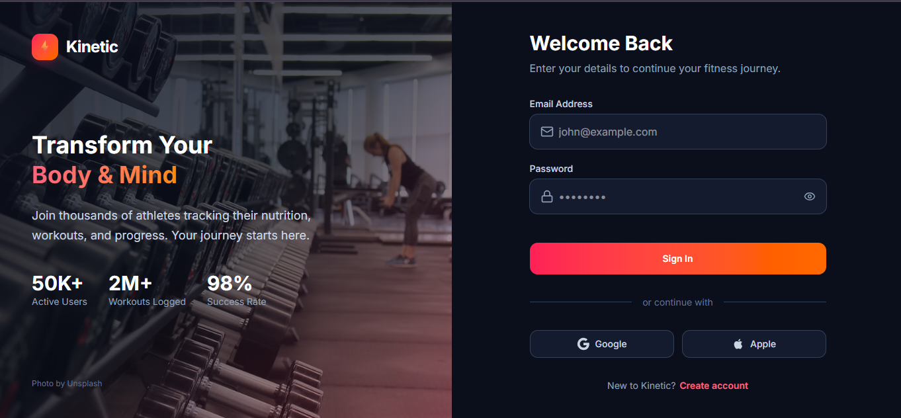
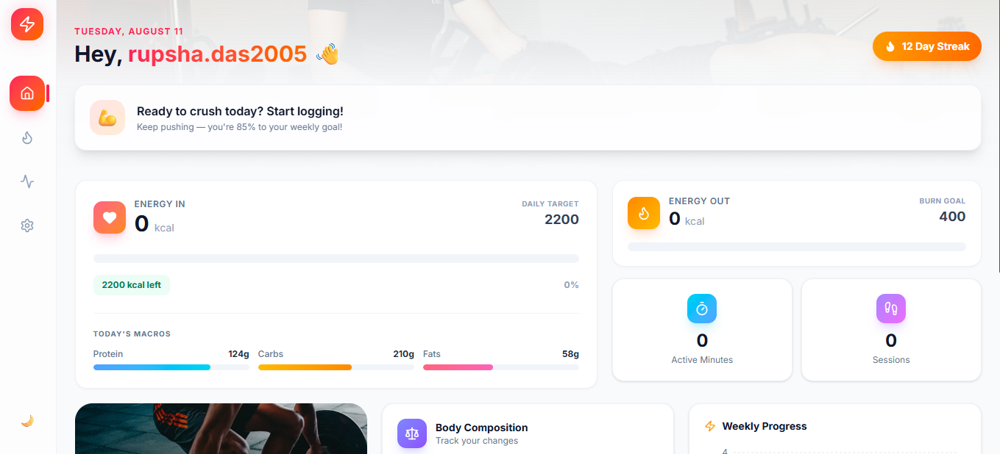
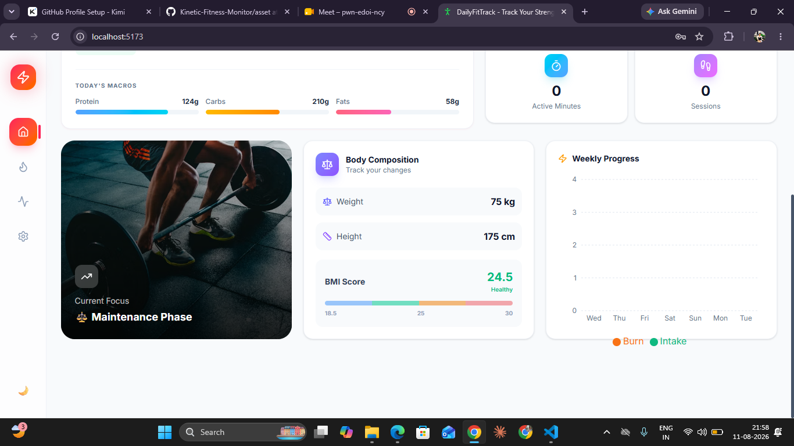
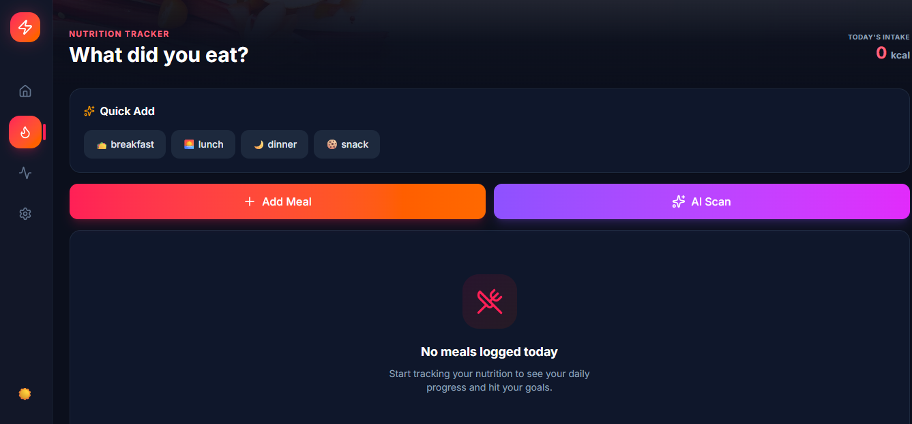
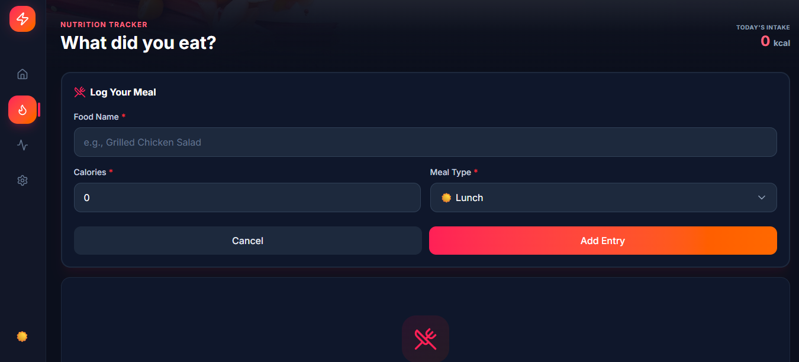
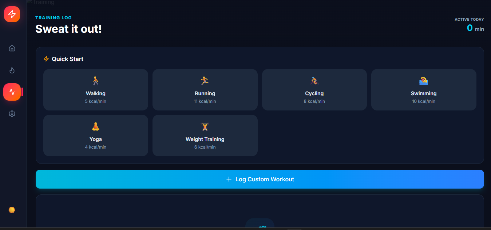
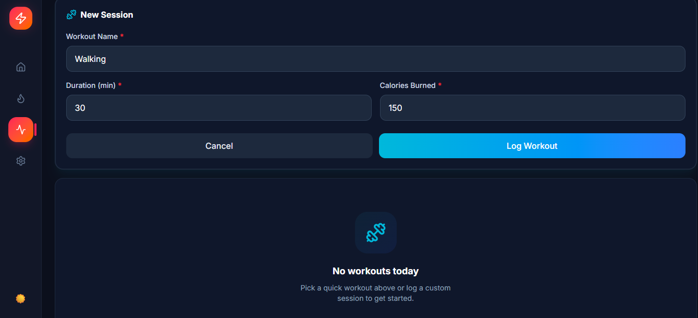
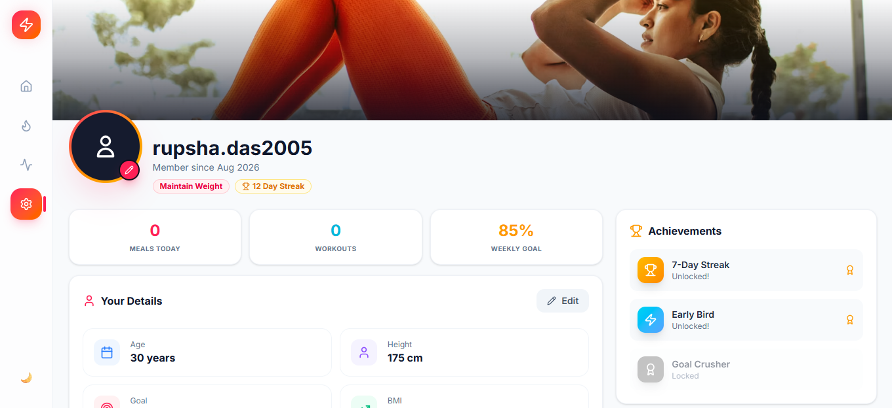
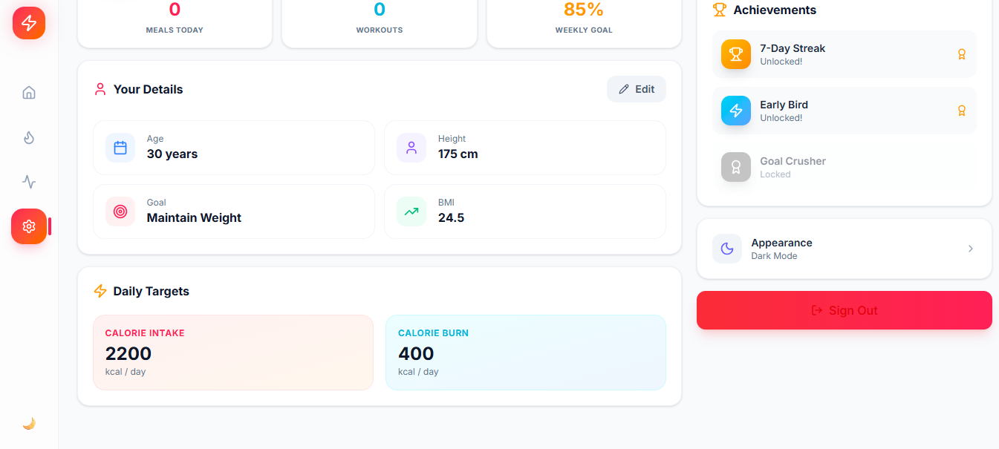

# Kinetic — Fitness & Nutrition Tracker

> **A full-stack fitness tracking application** built with React, TypeScript, Tailwind CSS, and Strapi. Track nutrition, log workouts, monitor body metrics, and visualize progress — all in a beautiful, modern interface.


---

## 📸 Screenshots

| Login Page | Dashboard | Food Log |
|---|---|---|
|  |  <br>  |  <br> |

| Activity Log | Profile | Onboarding |
|---|---|---|
|  <br>  |  <br>  |  |

---

## 🤔 Why I Built This

I wanted to level up my TypeScript skills and learn how to structure a real full-stack app end-to-end. Instead of following a tutorial, I designed the UI myself and figured out the Strapi integration as I went. The rose-orange-indigo theme and glassmorphism cards were experiments in Tailwind — I didn't use Material UI or any component library.

---

## 🛠 Tech Stack

**Frontend:** React 18, TypeScript, Vite, Tailwind CSS, React Router DOM, Recharts, Lucide React

**Backend:** Strapi CMS, Node.js, SQLite, JWT Auth, REST API

**Tools:** Git, GitHub, ESLint

---

## ✨ Features

- 🔐 JWT-based auth with a 3-step post-login profile setup
- 📊 Dashboard with calorie tracking, macro splits, and weekly charts
- 🍎 Food logging with meal categories and photo upload
- 🏃 Activity tracking with emoji-based workout cards
- 👤 Profile page with avatar upload, body metrics, and achievements
- 🌙 Dark/light mode toggle
- 📱 Responsive — works on mobile, tablet, and desktop

---

## 📁 Project Structure

```
fitness_tracker/
├── client/          # React frontend
│   ├── src/
│   │   ├── components/   # Reusable UI components
│   │   ├── pages/        # Login, Dashboard, FoodLog, etc.
│   │   ├── context/      # Global state & theme
│   │   └── types/        # TypeScript interfaces
│   └── package.json
├── server/          # Strapi backend
│   └── src/
└── README.md
```

---

## 🚀 Getting Started

### Prerequisites
- Node.js (v18+)
- npm or yarn

### 1. Clone the Repository
```bash
git clone https://github.com/itsrupsha/Kinetic-Fitness-Monitor.git
cd Kinetic-Fitness-Monitor
```

### 2. Start the Backend (Strapi)
```bash
cd server
npm install
npm run develop
```
- Strapi Admin: http://localhost:1337/admin
- API Base: http://localhost:1337/api

### 3. Start the Frontend
```bash
cd client
npm install
npm run dev
```
- App: http://localhost:5173

### 4. Environment Variables

**`client/.env`:**
```env
VITE_API_URL=http://localhost:1337/api
```

**`server/.env`:**
```env
DATABASE_CLIENT=sqlite
JWT_SECRET=your-jwt-secret
ADMIN_JWT_SECRET=your-admin-jwt-secret
APP_KEYS=key1,key2,key3,key4
API_TOKEN_SALT=your-salt
TRANSFER_TOKEN_SALT=your-transfer-salt
```

---

## 🔮 Future Enhancements

- [ ] AI Food Recognition — OpenAI Vision API for photo-based calorie estimation
- [ ] Push Notifications — Reminders for logging meals and workouts
- [ ] Social Features — Follow friends, share achievements
- [ ] Export Data — PDF/CSV reports
- [ ] PWA Support — Offline mode
- [ ] Wearable Integration — Apple Health / Google Fit sync

---

## 👨‍💻 Author

**Rupsha Das**

- GitHub: [@itsrupsha](https://github.com/itsrupsha)
- LinkedIn: [Rupsha Das](https://www.linkedin.com/in/rupsha-das-430bbb285)
- Email: dsrupsha2005@gmail.com

---

## 📄 License

This project is open-source and available under the [MIT License](LICENSE).

---

&gt; Built with React, Strapi, and too much coffee.
